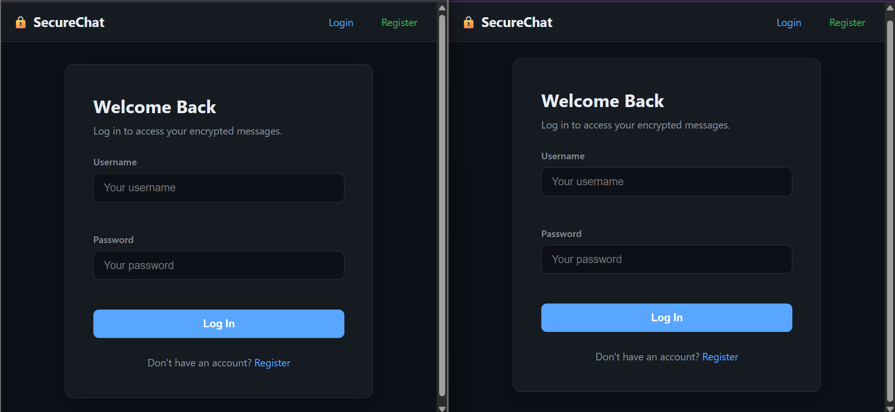
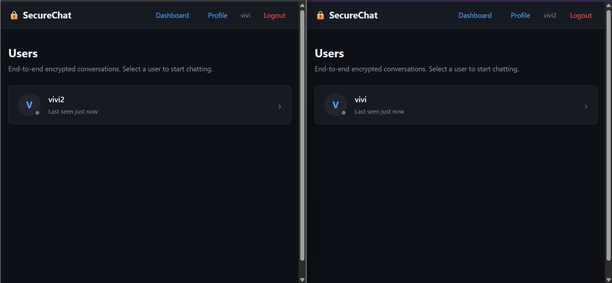
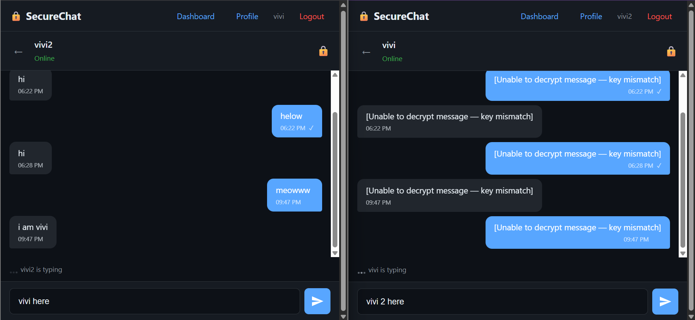
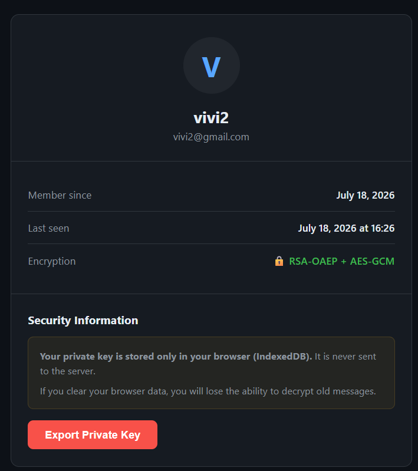

<div align="center">

# 🔐 SecureChat

**A secure, real-time messaging platform with true End-to-End Encryption built using Flask, WebSockets, and the Web Crypto API.**

Messages are encrypted **entirely within the browser**, ensuring the server never has access to plaintext data.


</div>

---

## 📖 Table of Contents

- Overview
- Features
- Screenshots
- Technology Stack
- Project Architecture
- Installation
- Usage
- API Reference
- Security Model
- Configuration
- Project Structure
- Future Improvements
- Contributing
- License

---

# 📌 Overview

SecureChat is a browser-based messaging application designed with **privacy-first principles**.

Unlike traditional messaging systems where messages are decrypted on the server, SecureChat performs **all cryptographic operations on the client** using the **Web Crypto API**.

The server acts only as a secure relay responsible for:

- Authentication
- Message delivery
- Presence tracking
- Storage of encrypted ciphertext

At no point does the server possess users' private keys or message plaintext.

---

# ✨ Features

## 🔒 Security

- End-to-End Encryption (RSA-OAEP + AES-GCM)
- Client-side key generation
- Zero plaintext stored on the server
- bcrypt password hashing
- CSRF protection
- Secure HttpOnly sessions
- Rate-limited authentication

## 💬 Messaging

- Real-time messaging
- WebSocket communication
- Read receipts
- Typing indicators
- Online / Offline presence
- Last Seen timestamps

## ⚙️ Backend

- Flask
- Flask-SocketIO
- SQLAlchemy ORM
- SQLite Database
- Eventlet asynchronous server

---

# 📷 Screenshots

> Replace these with your project screenshots.

| Login | Dashboard |
|--------|-----------|
|  |  |

| Chat | Profile |
|------|----------|
|  |  |

---

# 🛠 Technology Stack

| Layer | Technology |
|------------|-------------------------------|
| Backend | Python 3, Flask, Flask-SocketIO |
| Database | SQLite, SQLAlchemy |
| Authentication | Flask-Login, bcrypt |
| Frontend | HTML, CSS, Vanilla JavaScript |
| Cryptography | Web Crypto API |
| Encryption | RSA-OAEP 2048 + AES-GCM 256 |
| Communication | WebSockets |
| Security | CSRF, Rate Limiting, Secure Cookies |

---

# 🏗 Project Architecture

```
Client Browser
│
├── RSA Key Pair Generation
├── AES Session Key Generation
├── Encrypt Message
├── Decrypt Message
│
▼
Flask Server
│
├── Authentication
├── Session Management
├── WebSocket Relay
├── Database Storage
│
▼
SQLite Database

Stores:

• Encrypted Messages
• Encrypted AES Keys
• User Accounts
• Public Keys
```

---

# 📂 Project Structure

```
SecureChat
│
├── app.py
├── config.py
├── database.py
├── models.py
├── auth.py
├── routes.py
├── websocket.py
│
├── static
│   ├── css
│   │   └── style.css
│   │
│   └── js
│       ├── auth.js
│       ├── chat.js
│       ├── websocket.js
│       └── encryption.js
│
├── templates
│   ├── base.html
│   ├── login.html
│   ├── register.html
│   ├── dashboard.html
│   ├── profile.html
│   └── chat.html
│
└── securechat.db
```

---

# 🚀 Installation

Clone the repository

```bash
git clone https://github.com/yourusername/SecureChat.git
```

Navigate to the project

```bash
cd SecureChat
```

Create a virtual environment

```bash
python -m venv venv
```

Activate it

Windows

```bash
venv\Scripts\activate
```

Linux/macOS

```bash
source venv/bin/activate
```

Install dependencies

```bash
pip install -r requirements.txt
```

Run the application

```bash
python app.py
```

Open

```
http://127.0.0.1:5000
```

---

# 📡 API Reference

## Authentication

| Method | Endpoint |
|----------|----------------|
| POST | `/auth/register` |
| POST | `/auth/login` |
| GET | `/auth/logout` |

---

## User Routes

| Method | Endpoint |
|----------|-------------------|
| GET | `/dashboard` |
| GET | `/chat/<user_id>` |
| GET | `/profile` |

---

## API

| Method | Endpoint |
|---------|-------------------------------|
| GET | `/api/users` |
| GET | `/api/messages/<user_id>` |
| GET | `/api/public_key/<user_id>` |
| POST | `/api/update_public_key` |

---

## WebSocket Events

### Client → Server

- user_connected
- send_message
- typing
- stop_typing
- mark_read

### Server → Client

- new_message
- user_online
- user_offline
- user_typing
- user_stop_typing
- message_read

---

# 🔐 Security Model

### 1. RSA Key Generation

Each user generates a **2048-bit RSA-OAEP** key pair directly in the browser.

Private keys **never leave the client**.

---

### 2. AES Session Encryption

Each message is encrypted using a fresh **AES-GCM 256-bit** key.

That AES key is encrypted with the recipient's RSA public key.

---

### 3. Zero-Knowledge Server

The server stores only:

- Ciphertext
- Encrypted AES Keys
- Public Keys

It never has access to:

- Private Keys
- Plaintext Messages

---

### 4. Authentication

- bcrypt password hashing
- Rate limiting
- Secure cookies
- Flask-Login sessions

---

### 5. Additional Protections

- CSRF Tokens
- HttpOnly Cookies
- SameSite=Lax
- HTTPS Support
- WebSocket Same-Origin Policy

---

# ⚙ Configuration

Environment variables

| Variable | Description |
|---------------------------|-----------------------------|
| SECRET_KEY | Flask secret |
| DATABASE_URL | Database URI |
| MAX_LOGIN_ATTEMPTS | Login attempts |
| LOGIN_LOCKOUT_SECONDS | Lockout duration |
| MAX_MESSAGE_LENGTH | Maximum message size |
| SOCKETIO_ASYNC_MODE | Async backend |

---

# 🚧 Future Improvements

- Group Chats
- File Sharing
- Voice Messages
- Video Calling
- Multi-device Synchronization
- Forward Secrecy
- Push Notifications
- Message Search
- Dark Mode
- Docker Deployment

---

# 🤝 Contributing

Contributions are welcome.

1. Fork the repository.
2. Create a feature branch.

```bash
git checkout -b feature/new-feature
```

3. Commit your changes.

```bash
git commit -m "Add new feature"
```

4. Push your branch.

```bash
git push origin feature/new-feature
```

5. Open a Pull Request.

---

# 📜 License

This project is intended for **educational purposes**.

Feel free to fork and modify it for learning or research.

---

<div align="center">

**Built by ModernStone**

</div>
